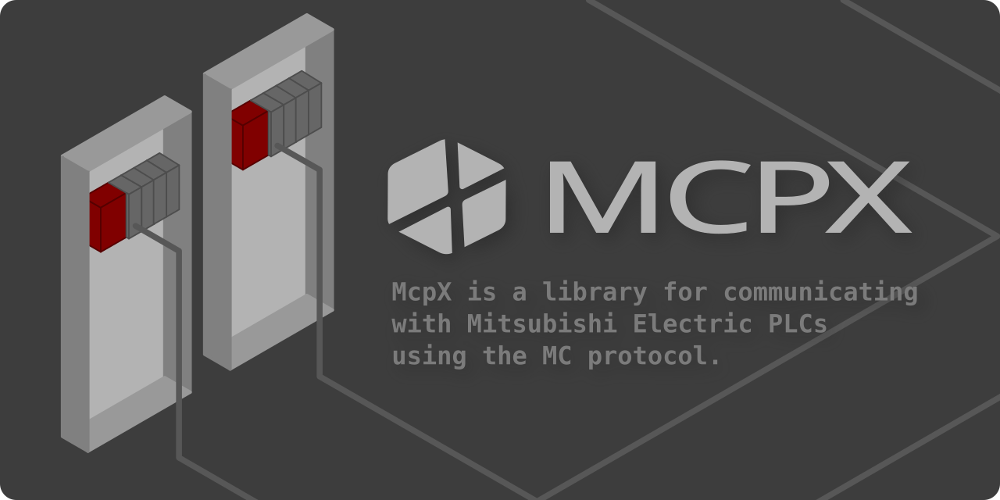

<br>
<p>
  
  
  
  
  
  
  
  
  <a href="https://flatt.tech/oss/gmo/trampoline" target="_blank"></a>
</p>

<p>
  <a href="README_JA.md">日本語</a> | <a href="README.md">English</a>
</p>

**McpX is a library for communicating with Mitsubishi Electric PLCs using the MC protocol.**  
It features a simple and easy-to-use API, allowing you to communicate without worrying about MC protocol details.  
It runs on various platforms, including Linux, Windows, and macOS.

## Installation
### .NET CLI
```sh
dotnet add package McpX
```
### Package Manager(Visual Studio)
```sh
PM> NuGet\Install-Package McpX
```

## Example Usage 
```csharp
using McpXLib;
using McpXLib.Enums;

// Connect to PLC by specifying IP and port
using (var mcpx = new McpX("192.168.12.88", 10000))
{
    // Read 7000 points starting from M0
    bool[] mArr = mcpx.BatchRead<bool>(Prefix.M, "0", 7000);
    
    // Read 7000 words starting from D1000
    short[] dArr = mcpx.BatchRead<short>(Prefix.D, "1000", 7000);

    // Write 1234 to D0 and 5678 to D1 as signed 32-bit integers
    mcpx.BatchWrite<int>(Prefix.D, "0", [1234, 5678]);
}
```
[C# and Visual Basic samples are available here.](https://github.com/YudaiKitamura/McpX/tree/main/Example)

## Supported Commands

| Name                         | Description                                                            | Synchronous Method                                      | Asynchronous Method                                              |
|------------------------------|------------------------------------------------------------------------|---------------------------------------------------------|------------------------------------------------------------------|
| **Single Read**              | Reads a single value from the specified device.                        | `Read<T>(Prefix prefix, string address)`                | `ReadAsync<T>(Prefix prefix, string address)`                   |
| **Single Write**             | Writes a single value to the specified device.                         | `Write<T>(Prefix prefix, string address, T value)`     | `WriteAsync<T>(Prefix prefix, string address, T value)`         |
| **Batch Read**               | Reads multiple consecutive values starting from the specified address. | `BatchRead<T>(Prefix prefix, string address, ushort length)` | `BatchReadAsync<T>(Prefix prefix, string address, ushort length)` |
| **Batch Write**              | Writes an array of values to consecutive device addresses.             | `BatchWrite<T>(Prefix prefix, string address, T[] values)`   | `BatchWriteAsync<T>(Prefix prefix, string address, T[] values)` |
| **Random Read**              | Reads values from non-consecutive word and double-word addresses.     | `RandomRead<T1, T2>((Prefix, string)[] wordAddresses, (Prefix, string)[] doubleWordAddresses)` | `RandomReadAsync<T1, T2>((Prefix, string)[] wordAddresses, (Prefix, string)[] doubleWordAddresses)` |
| **Random Write**             | Writes values to non-consecutive word and double-word addresses.      | `RandomWrite<T1, T2>(...)`                              | `RandomWriteAsync<T1, T2>(...)`                                 |
| **Monitor Registration**     | Registers devices to monitor.                                          | `MonitorRegist((Prefix, string)[] wordAddresses, (Prefix, string)[] doubleWordAddresses)` | `MonitorRegistAsync((Prefix, string)[] wordAddresses, (Prefix, string)[] doubleWordAddresses)` |
| **Monitor Read**             | Reads the latest values from registered monitoring devices.            | `Monitor<T1, T2>(...)`                                  | `MonitorAsync<T1, T2>(...)`                                     |
| **Remote Password Lock/Unlock** | Automatically locks the PLC with the specified remote password when the instance is created and unlocks it when disposed. | `McpX(string ip, int port, string? password = null)`   | –                                                                |

## Supported Protocols
- TCP
- UDP
- 3E frame (binary code)
- 3E frame (ASCII code)
- 4E frame (binary code)
- 4E frame (ASCII code)

## Roadmap
- [x] ~~3E frame (ASCII code) support~~
- [x] ~~4E frame (binary code) support~~
- [x] ~~4E frame (ASCII code) support~~
- [x] ~~UDP support~~
- [ ] GX Simulator support – In progress

## Changelog
- [CHANGELOG.md](./CHANGELOG.md)

## Related
- [mcpx-mcp-server](https://github.com/YudaiKitamura/mcpx-mcp-server) An MCP(Model Context Protocol) server that enables real-time access to Mitsubishi Electric PLC devices from generative AI.
