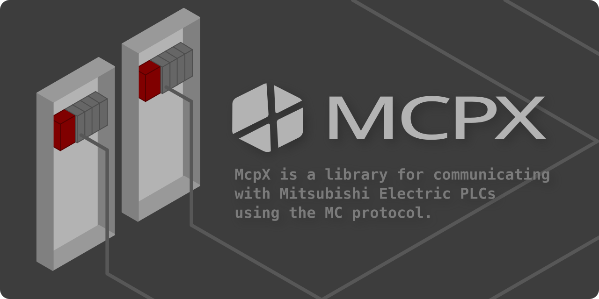

<br>
<p>
  
  
  
  
  
  
  
  
</p>

<p>
  <a href="README_JA.md">日本語</a> | <a href="README.md">English</a>
</p>

McpXは、三菱電機製PLCと通信するためのMCプロトコル対応ライブラリです。<br>
シンプルなAPIで扱いやすく、MCプロトコルを意識することなく利用でき、Linux、Windows、macOS など、さまざまなプラットフォームで動作します。

## インストール方法
### .NET CLI
```sh
dotnet add package McpX
```
### Package Manager(Visual Studio)
```sh
PM> NuGet\Install-Package McpX
```

## 使用例
```csharp
using McpXLib;
using McpXLib.Enums;

// IP、Portを指定してPLCに接続
using (var mcpx = new McpX("192.168.12.88", 10000))
{
    // M0から7000点取得
    bool[] mArr = mcpx.BatchRead<bool>(Prefix.M, "0", 7000);
    
    // D1000から7000ワード取得
    short[] dArr = mcpx.BatchRead<short>(Prefix.D, "1000", 7000);

    // D0に1234、D1に5678を符号あり32ビットで書込み 
    mcpx.BatchWrite<int>(Prefix.D, "0", [1234, 5678]);

    // 範囲と単一デバイスをまとめて読み込み（範囲:連続アクセス、単一:ランダムアクセス）
    short[] block = [];
    int total = 0;
    mcpx.Read(b => b
        .Add<short>(Prefix.D, "400", 100, v => block = v)
        .Add<int>(Prefix.D, "2000", v => total = v));
}
```
[C#、Visual Basicのサンプルはこちら](https://github.com/YudaiKitamura/McpX/tree/main/Example)

### GX Simulator3 への接続
`McpXSimulator` を使うと、システムNo.と号機No.を指定して GX Simulator3（GX Works3 のシミュレーション機能）に接続できます。
ポート番号は `5500 + システムNo. × 10 + 号機No.` です（例：システム1・号機1 = 5511、システム2・号機1 = 5521）。
複数のシミュレータに同時に接続する場合は、シミュレータごとにインスタンスを生成します。読み書きのAPIは `McpX` と同じです。
```csharp
using var sim1 = new McpXSimulator();                                  // 127.0.0.1:5511（システム1・号機1）
using var sim2 = new McpXSimulator(systemNo: 2, ip: "192.168.12.90");  // 192.168.12.90:5521
using var cpu2 = new McpXSimulator(systemNo: 1, cpuNo: 2);             // 127.0.0.1:5512（マルチCPUの2号機）

sim1.Write(Prefix.D, "100", (short)123);
short d0 = sim2.Read<short>(Prefix.D, "0");
int port = McpXSimulator.GetPort(systemNo: 2);                        // 5521
```
GX Simulator3 は 127.0.0.1 でのみ待ち受けます。別のPCから接続する場合は、シミュレータ側のPCで各ポートを 127.0.0.1 へ転送してください（`netsh interface portproxy` など）。
交信はTCP・バイナリコードのみです（GX Simulator3 はASCIIコードの交信に応答しません）。

## 対応コマンド

| 名称                     | 説明                                             | 同期メソッド                                     | 非同期メソッド                                               |
|------------------------|------------------------------------------------|---------------------------------------------|------------------------------------------------------------|
| **単一読出し**          | デバイスの単一値を取得します。                       | `Read<T>(Prefix prefix, string address)`   | `ReadAsync<T>(Prefix prefix, string address)`             |
| **単一書込み**          | デバイスに単一値を書き込みます。                       | `Write<T>(Prefix prefix, string address, T value)` | `WriteAsync<T>(Prefix prefix, string address, T value)`   |
| **一括読出し**          | 連続したデバイスから、指定数のデータを一括で読み出します。    | `BatchRead<T>(Prefix prefix, string address, ushort length)` | `BatchReadAsync<T>(Prefix prefix, string address, ushort length)` |
| **一括書込み**          | 複数のデバイスに配列で指定した値を一括書き込みします。        | `BatchWrite<T>(Prefix prefix, string address, T[] values)`  | `BatchWriteAsync<T>(Prefix prefix, string address, T[] values)`  |
| **ランダム読出し**       | 非連続デバイス（ビット／ワード／ダブルワード）を読み出します。   | `RandomRead(Action<RandomReadBuilder> build)`   | `RandomReadAsync(Action<RandomReadBuilder> build)`        |
| **ランダム書込み**       | 非連続デバイス（ビット／ワード／ダブルワード）へ書き込みます。   | `RandomWrite(Action<RandomWriteBuilder> build)` | `RandomWriteAsync(Action<RandomWriteBuilder> build)`      |
| **モニタ登録**           | モニタ対象デバイスを登録し、`MonitorSession` を返します。    | `MonitorRegist(Action<MonitorBuilder> build)`   | `MonitorRegistAsync(Action<MonitorBuilder> build)`        |
| **モニタ読み取り**        | 返却されたセッション経由で登録済みデバイスの最新値を読み出します。 | `MonitorSession.Read()`                    | `MonitorSession.ReadAsync()`                              |
| **統合読み込み**          | 範囲指定（点数あり）と単一指定のデバイスをまとめて読み込みます。範囲は連続アクセス（範囲が複数あれば複数ブロック一括読出し）、単一はランダムアクセスで読み込みます。 | `Read(Action<ReadBuilder> build)`   | `ReadAsync(Action<ReadBuilder> build)`   |
| **統合書き込み**          | 範囲指定（配列）と単一指定のデバイスにまとめて書き込みます。配列は連続アクセス（範囲が複数あれば複数ブロック一括書込み）、単一値はランダムアクセスで書き込みます。 | `Write(Action<WriteBuilder> build)` | `WriteAsync(Action<WriteBuilder> build)` |
| **複数ブロック一括読出し**  | 連続したデバイスの範囲（ブロック）を複数指定し、1回の交信でまとめて読み出します（コマンド: 0406）。 | `BlockRead(Action<BlockReadBuilder> build)`   | `BlockReadAsync(Action<BlockReadBuilder> build)`   |
| **複数ブロック一括書込み**  | 連続したデバイスの範囲（ブロック）を複数指定し、1回の交信でまとめて書き込みます（コマンド: 1406）。 | `BlockWrite(Action<BlockWriteBuilder> build)` | `BlockWriteAsync(Action<BlockWriteBuilder> build)` |
| **リモートRUN / STOP / PAUSE** | CPUユニットの動作状態を変更します（コマンド: 1001 / 1002 / 1003）。 | `RemoteRun(bool force, RemoteRunClearMode clearMode)` / `RemoteStop()` / `RemotePause(bool force)` | `RemoteRunAsync(...)` / `RemoteStopAsync()` / `RemotePauseAsync(...)` |
| **リモートラッチクリア / RESET** | ラッチクリア、リセットを実行します（コマンド: 1005 / 1006）。STOP状態で実行してください。 | `RemoteLatchClear()` / `RemoteReset()` | `RemoteLatchClearAsync()` / `RemoteResetAsync()` |
| **リモートパスワード ロック/アンロック** | リモートパスワード指定時、インスタンス生成時にロック、破棄時に自動アンロックします。 | `McpX(string ip, int port, string? password = null)` | －                                                          |


## 対応プロトコル
- TCP
- UDP
- 3Eフレーム（バイナリコード）
- 3Eフレーム（ASCIIコード）
- 4Eフレーム（バイナリコード）
- 4Eフレーム（ASCIIコード）

## 今後の予定
- [x] ~~3Eフレーム（ASCIIコード）対応~~
- [x] ~~4Eフレーム（バイナリコード）対応~~
- [x] ~~4Eフレーム（ASCIIコード）対応~~
- [x] ~~UDP対応~~
- [x] ~~GX Simulator 対応~~

## 変更履歴
- [CHANGELOG_JA.md](./CHANGELOG_JA.md)

## 関連
- [mcpx-mcp-server](https://github.com/YudaiKitamura/mcpx-mcp-server) 生成AIから三菱電機製 PLC のデバイスへリアルタイムアクセスを可能にする MCP(Model Context Protocol)サーバー
