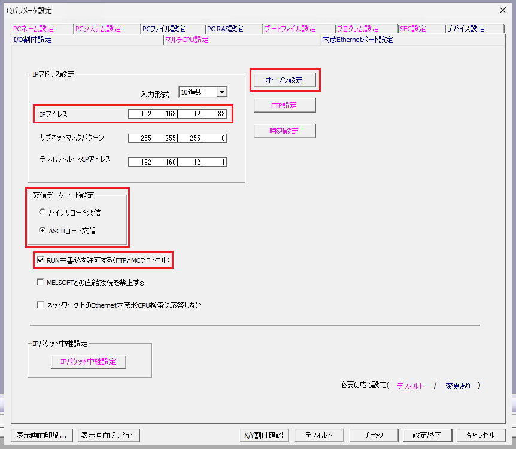
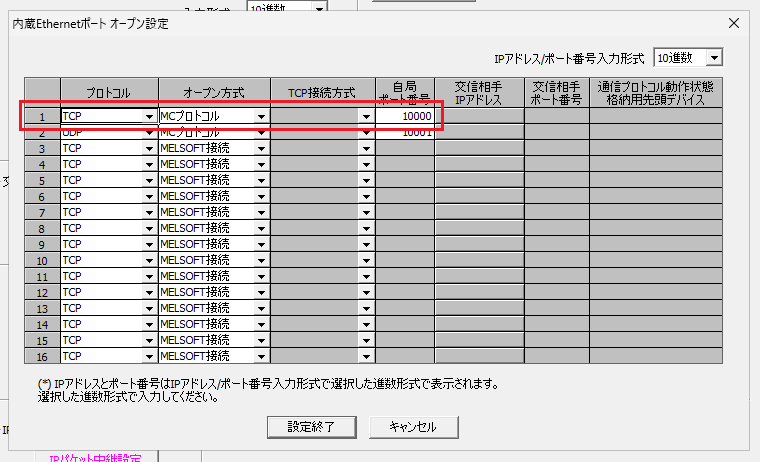

# PLCパラメータ設定
## 内蔵Ethernet使用時



|設定項目|説明|[Mcpxのパラメータ](/api/McpXLib.McpX.html#constructors)|
|:-|:-|:-|
|IPアドレス|PLCのIPアドレスを指定します。|コンストラクタの```ip```にPLCのIPを指定します。|
|交信データコード|```バイナリコード交信```、```ASCIIコード交信```を指定します。|```ASCIIコード交信```の場合にコンストラクタの```isAscii```に```true```を指定します。|
|RUN中書込を許可する|デバイスに書込みを行う場合に有効にします。|-|
|プロトコル|```TCP```、```UDP```を指定します。|```UDP```の場合にコンストラクタの```isUdp```に```true```を指定します。|
|オープン方式|```MCプロトコル```を指定します。|-|
|自局ポート番号|通信を行うポート番号（1025～4999, 5010～65534の範囲）を指定します。|コンストラクタの```port```にPLCのポート番号を指定します。|

